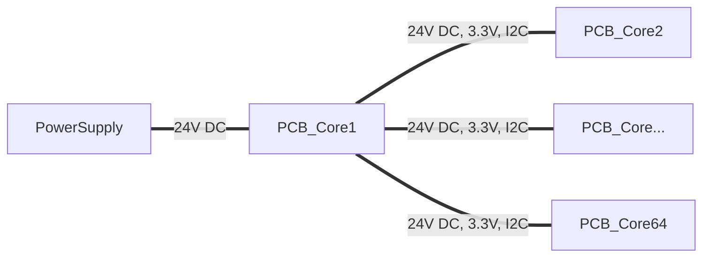

# Model Train Control

Control unit for analog model trains, based on ESPHome. A Home Assistant instance is used for visualization and control. This board is stackable up to 64 boards and every board has 16 outputs (3 pin). The Voltage is limited on the outputs per ESPHome template.

## Parts

* `PCB_Core` - Single board with 16 H-Bridges, ESP32 module placement, Reverse Voltage, OV and UV protection

## Supported szenarios

- Power line
- Train Switch
- Signal
- Light
- Uncoupler

## ESPHome

### Template

### Variants

#### Power line

#### Train Switch

#### Signal

#### Light

#### Uncoupler
