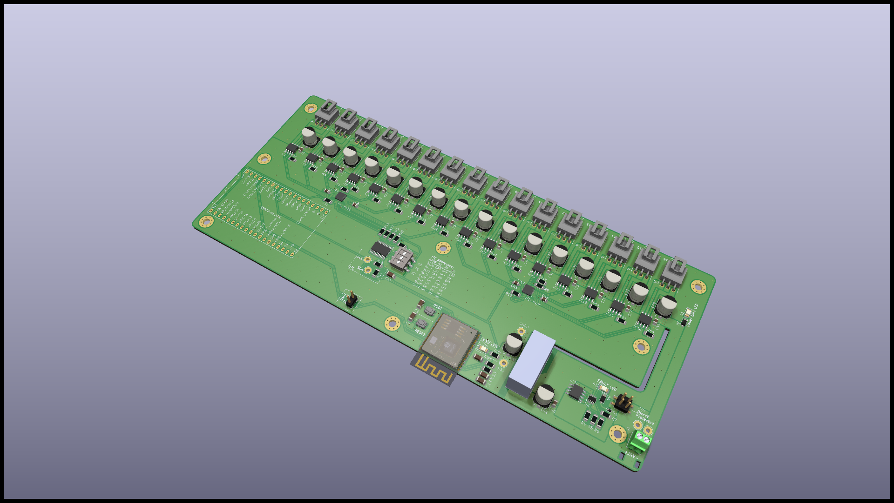
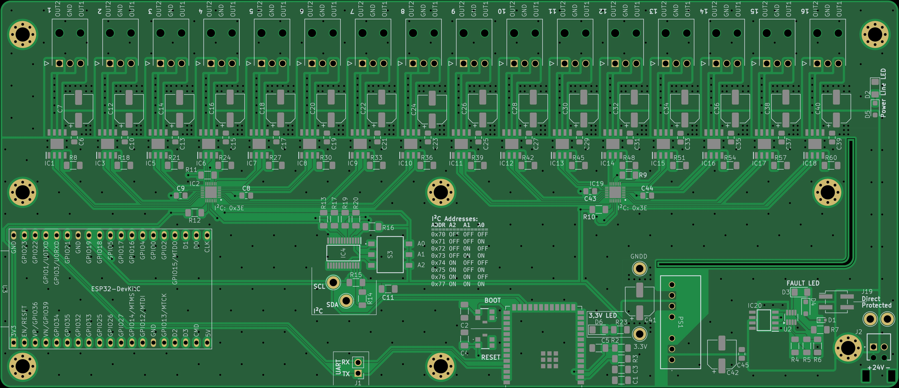
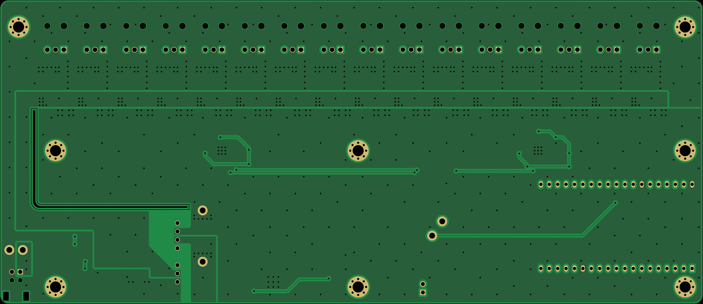
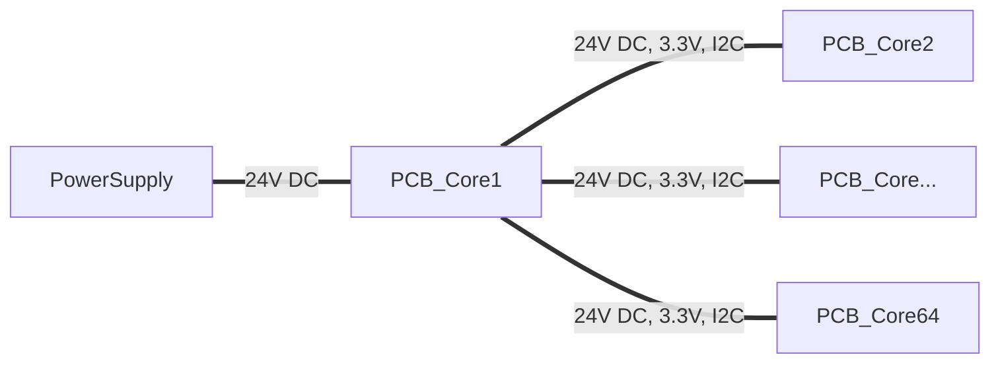

# Model Train Control

Control unit for analog model trains, based on ESPHome. A Home Assistant instance is used for visualization and control. This board is stackable up to 64 boards and every board has 16 outputs (3 pin). The Voltage is limited on the outputs per ESPHome template.
It comes in three variants, but all variants are the same boards. Only some components are not placed.

* Primary node with ESP32-S3-Wroom-2
* Primary node with ESP32-Devkit (can also be used as sub node with 3,3V power supply and protection)
* Sub node

## Features

* 16 h-bridges per board and stackable to 64 boards
* Reverse Voltage, Over Voltage and Under Voltage protection
* (optional) ESP32-Devkit
* (optional) ESP32-S3-Wroom-2

## Simple graphic of the board connections

## Supported szenarios

- Power line
- Yield
- Generic Switch
- Signal
- Uncoupler
