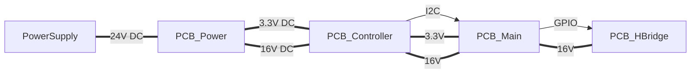

# Model Train Control

Control unit for analog model trains, based on ESPHome. For visualation and controlling I using a Home Assistant instance.

## Parts

* pcb_hbridge - HBridge with is used as a three state switch or as a variable power control for the power line.
* pcb_main - Main pcb for the project 

## Supported szenarios

- Power line
- Train Switch
- Signal
- Light
- Uncoupler

## ESPHome

### Template

### Variants

#### Power line

#### Train Switch

#### Signal

#### Light

#### Uncoupler
