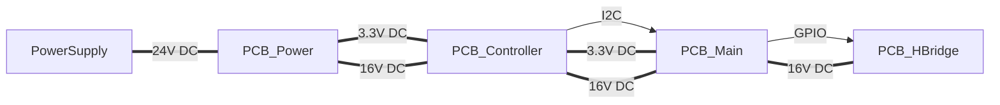

# Model Train Control

Control unit for analog model trains, based on ESPHome. A Home Assistant instance is used for visualization and control. Every `PCB_Controller` can handle four `PCB_Main` and erver `PCB_Main` can handle eight `PCB_HBridge`. With this, every block has thirty two pwm outputs.

## Parts

* `PCB_Controller` - Controller board with a ESP32 DEV board as the brain of the block 
* `PCB_Main` - Switch board to handle 8 PCB_HBridge boards, with are controlled per I2C from the ESP32.
* `PCB_HBridge` - HBridge with is used as a three state switch or as a variable power control for the power line.
* `PCB_Power` - A simple power supply to give 3.3V and 16V (adjustable)

## Supported szenarios

- Power line
- Train Switch
- Signal
- Light
- Uncoupler

## ESPHome

### Template

### Variants

#### Power line

#### Train Switch

#### Signal

#### Light

#### Uncoupler
